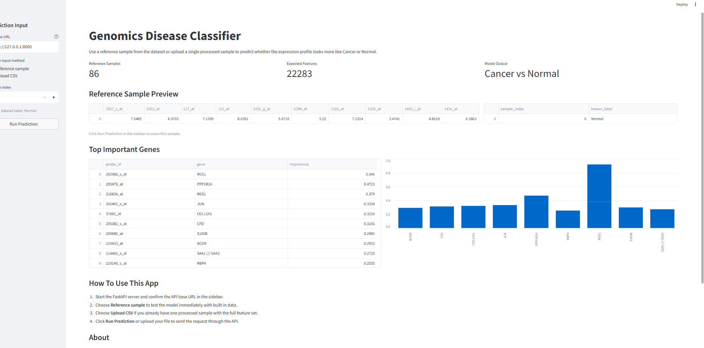
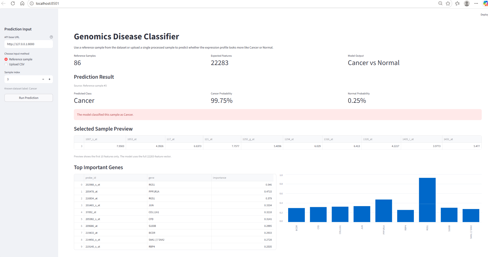
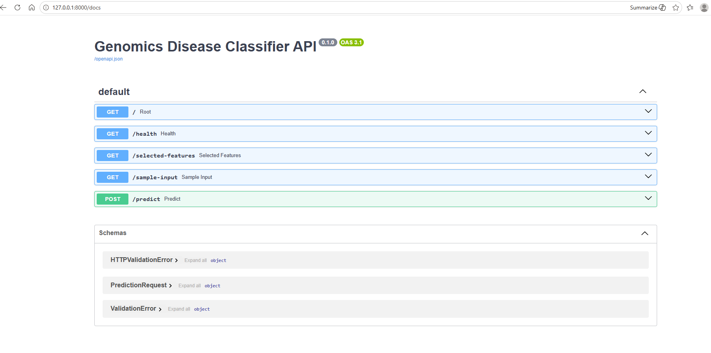

# Genomics Disease Classifier

An end-to-end machine learning application that classifies gene expression samples as `Cancer` or `Normal` using a GEO microarray dataset, a scikit-learn training pipeline, a FastAPI backend, and a Streamlit frontend.


## Overview

This project moves beyond a notebook-only workflow and packages the full ML lifecycle into a runnable application:

- data preprocessing from GEO expression files
- feature selection with the top 200 statistically relevant features
- model comparison between Logistic Regression and Random Forest
- cross-validation-based model selection
- API-driven inference with FastAPI
- interactive prediction UI with Streamlit
- SHAP-based interpretability outputs
- Dockerized frontend + backend deployment

## Screenshots

Add your real screenshots to `docs/screenshots/` and they will render here.

### Streamlit Dashboard



### Prediction Result



### FastAPI Swagger Docs



## Why This Project

Gene expression data is high-dimensional and difficult to use directly in a user-facing application. This project demonstrates how to take raw biomedical tabular data, build a reproducible ML pipeline, and expose it in a way that works for both developers and non-technical users.

## Tech Stack

- Python
- pandas
- numpy
- scikit-learn
- FastAPI
- Uvicorn
- Streamlit
- joblib
- SHAP
- matplotlib
- pytest
- Docker / Docker Compose

## Architecture

```text
Raw GEO Data
    ->
Preprocessing + Label Extraction
    ->
Feature Selection (SelectKBest, top 200)
    ->
Model Training + Cross-Validation
    ->
Saved Artifacts (model.pkl, selector.pkl)
    ->
FastAPI Inference API
    ->
Streamlit Frontend
```

## Project Structure

```text
biotech-ml-pipeline/
|-- api/
|   `-- app.py
|-- dashboard/
|   `-- streamlit_app.py
|-- data/
|   `-- raw/
|-- docs/
|   `-- screenshots/
|-- models/
|-- src/
|   |-- config.py
|   |-- preprocessing.py
|   |-- train.py
|   |-- evaluate.py
|   `-- explain.py
|-- tests/
|   `-- test_api.py
|-- Dockerfile.api
|-- Dockerfile.streamlit
|-- docker-compose.yml
|-- requirements.txt
`-- README.md
```

## Data Source

The project uses GEO microarray files stored locally in `data/raw/`:

- `GSE15852_series_matrix.txt`
- `GPL96-57554.txt`

These files are used for:

- expression matrix loading
- label extraction from sample titles
- probe-to-gene mapping for interpretability outputs

## ML Pipeline

### Preprocessing

Implemented in `src/preprocessing.py`:

- loads tabular gene expression data
- converts values to numeric
- drops invalid rows
- applies `log1p` normalization
- extracts `Cancer` / `Normal` labels from sample metadata

### Feature Selection

The training pipeline uses:

- `SelectKBest(score_func=f_classif, k=200)`

This means:

- the model is trained on 200 selected features
- the API still accepts the full original feature vector
- the saved selector applies the same transformation during inference

### Model Selection

Implemented in `src/train.py`:

- Logistic Regression
- Random Forest

Selection strategy:

- 5-fold stratified cross-validation using ROC-AUC
- single train/test split metrics for readability
- final saved model selected by mean CV ROC-AUC

### Saved Artifacts

Generated in `models/`:

- `model.pkl`
- `selector.pkl`
- `selected_200_features.csv`
- `gene_importance.csv`
- `top10_genes.csv`

## API

The FastAPI app lives in `api/app.py`.

### Main Endpoints

- `GET /`
- `GET /health`
- `GET /sample-input`
- `POST /predict`
- `GET /selected-features`

### Example Prediction Request

```json
{
  "features": ["full feature vector here"]
}
```

The example above is intentionally shortened. It is a shape example, not a real payload.

In this project:

- the API expects the full original feature vector
- the saved selector was fitted on `22283` input features
- the selector then reduces that full vector to the top `200` selected features before the model predicts

So a real request body must contain `22283` numeric values in `features`, not 3.

### Example Prediction Response

```json
{
  "prediction": 1,
  "label": "Cancer",
  "cancer_probability": 0.9995
}
```

## Frontend

The Streamlit app lives in `dashboard/streamlit_app.py`.

It provides:

- built-in reference sample selection
- custom CSV upload for a single sample
- API-connected prediction flow
- input preview and result display
- feature importance display

## Running Locally

### 1. Install dependencies

```powershell
pip install -r requirements.txt
```

### 2. Train the model

```powershell
python -m src.train
```

### 3. Start the API

```powershell
uvicorn api.app:app --reload
```

Open:

- `http://127.0.0.1:8000/docs`

### 4. Start the frontend

```powershell
streamlit run dashboard/streamlit_app.py
```

Open:

- `http://localhost:8501`

## Running with Docker

To run the frontend and backend together:

```powershell
docker compose up --build
```

Open:

- Frontend: `http://localhost:8501`
- API docs: `http://localhost:8000/docs`

### Docker Setup Notes

Before running Docker, make sure:

1. Docker Desktop is installed and running
2. trained artifacts already exist in `models/`

If model files are missing, generate them first:

```powershell
python -m src.train
```

### Full Docker Run Flow

1. Install Docker Desktop
2. Start Docker Desktop
3. From the project root, run:

```powershell
docker compose up --build
```

4. Wait for both services to start
5. Open:

- Streamlit frontend: `http://localhost:8501`
- FastAPI docs: `http://localhost:8000/docs`

### What Docker Starts

- `api`
  - FastAPI backend on port `8000`
- `frontend`
  - Streamlit app on port `8501`

## Testing

A compact pytest suite covers the main API flows.

Run:

```powershell
pytest
```

Current coverage includes:

- valid prediction flow
- invalid feature count handling
- selected-features endpoint
- missing selected-features file handling

## Interpretability

`src/explain.py` uses SHAP to generate feature importance outputs from the saved model and selected features.

Run:

```powershell
python -m src.explain
```

Outputs are saved into `models/`.

## Dependencies

Core dependencies:

- pandas
- numpy
- scikit-learn
- fastapi
- uvicorn
- streamlit
- joblib
- shap
- matplotlib
- pytest
- httpx

## Dataset and Feature Details

The main expression dataset is loaded from:

- `data/raw/GSE15852_series_matrix.txt`

After preprocessing and transposing:

- rows represent samples
- columns represent original input features

Current feature counts in this project:

- original input features expected by the API: `22283`
- selected features used by the trained model: `200`

Why both numbers matter:

- `22283` is the full expression vector sent to `/predict`
- `200` is the reduced feature set used internally after `selector.pkl` transforms the input

If you want a valid input example, use:

- `GET /sample-input`

That endpoint returns a real request body with the correct full-length feature vector.

## Limitations

- the dataset is relatively small, so very strong scores should be interpreted carefully
- the API currently expects the full original feature vector
- local raw data and trained artifacts are required for the current workflow

## Future Improvements

- add CI for automated test runs
- store structured training metadata
- support raw-file upload preprocessing in the frontend
- add model versioning to the API
- improve deployment polish for cloud hosting
